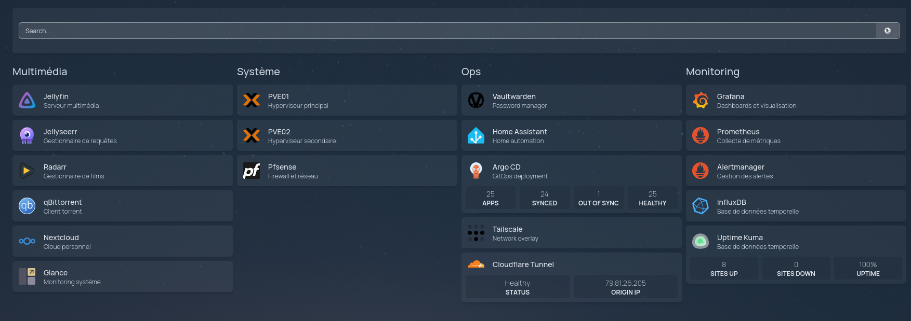

<div align="center">

##  Mes Applications de mon Homelab 


_... géré avec Terraform, ArgoCD, et Talos Linux_ 

</div>

<div align="center">

[](https://talos.dev)&nbsp;&nbsp;
[](https://kubernetes.io)&nbsp;&nbsp;
[](https://argo-cd.readthedocs.io)&nbsp;&nbsp;
[](https://terraform.io)

</div>

<div align="center">

[](https://tailscale.com)&nbsp;&nbsp;
[](https://www.cloudflare.com)&nbsp;&nbsp;
[](https://proxmox.com)

</div>

<div align="center">

[](https://kromgo.wheezy.fr)&nbsp;&nbsp;
[](https://kromgo.wheezy.fr)&nbsp;&nbsp;
[](https://kromgo.wheezy.fr)&nbsp;&nbsp;
[](https://kromgo.wheezy.fr)&nbsp;&nbsp;
</div>

---

##  Vue d'ensemble



### GitOps avec ArgoCD

[ArgoCD](https://argo-cd.readthedocs.io/) surveille le repository [argocd-apps-homelab](https://github.com/florianspk/argocd-apps-homelab) et synchronise automatiquement l'état désiré des applications avec le cluster Kubernetes.

Les applications sont organisées par famille et par cluster, permettant une gestion granulaire des déploiements et des mises à jour.

### Structure des répertoires

```sh
📁 argocd-apps-homelab
├── 📁 apps
│     ├── 📁 apps-ops
│     ├── 📁 apps-monitoring
│         ├── 📁 kube-prometheus-stack
│         │    ├── 📁 extras
│         │    ├── 📄 prd.json
│         │    ├── 📄 dev.json
│         │    └── 📄 staging.json
│         └── 📁 apps-ops
│
├── 📁 bootstrap
├── 📁 projects
└── 📄 renovate.json
```

---
